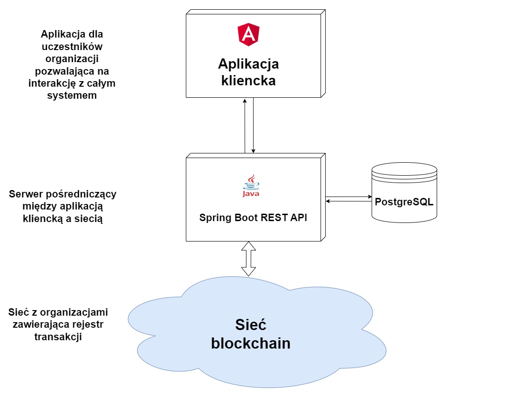
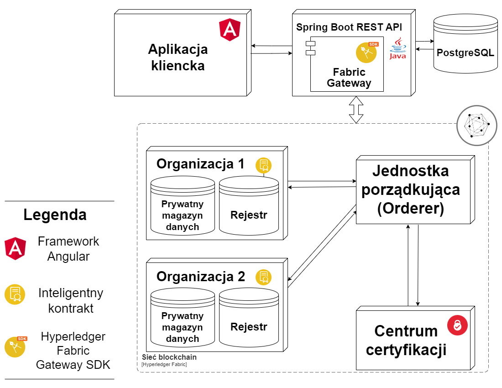
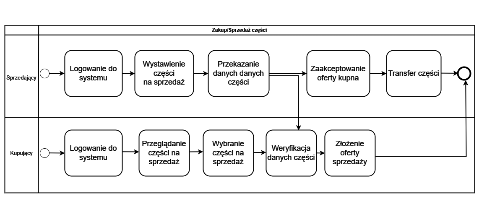
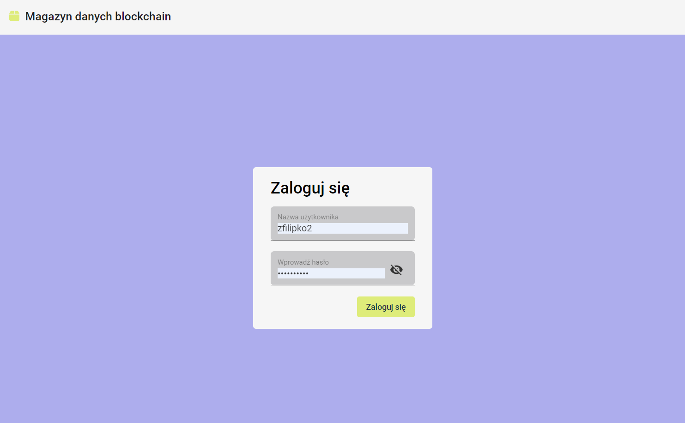
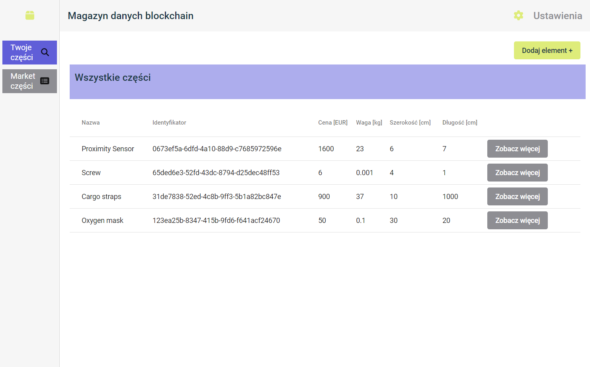
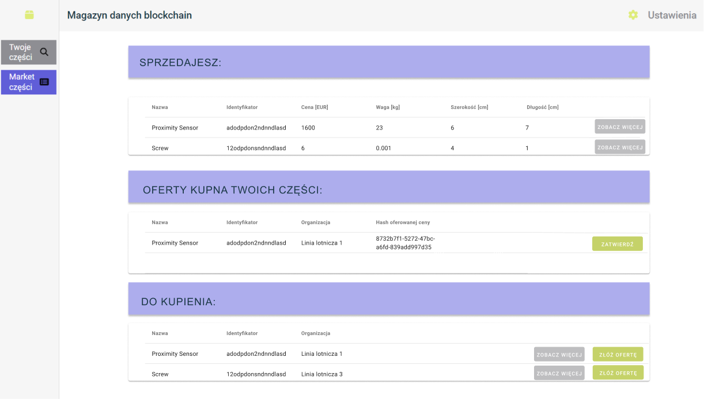

# airplane-parts-blockchain-tracker
MDB (Magazyn Danych Blockchain) Project
Welcome to the MDB project repository, a system designed to revolutionize how information about airplane parts is stored and managed using blockchain technology.

I developed this project as a crucial component of my engineering thesis, focusing on the topic of "Data Storage of Aircraft Parts Maintenance Using Blockchain Technology."

## Features:
- **Blockchain-Powered Storage:** Securely store and manage aviation component data using the robust blockchain infrastructure.
- **Web Application Interface:** Intuitive web application for seamless interaction with the MDB system.
- **Smart Contracts:** Implementing smart contracts for transparent and secure transactions, ensuring data integrity.
- **User Authentication:** Multi-layered user authentication for controlled access and enhanced security.
- **Hyperledger Fabric Integration:** Leveraging the power of Hyperledger Fabric for a trusted and efficient blockchain network.

## Architecture

Detailed architecture:

## BPMN Sale process

## UI

Login page:

View after login:

Marketplace:

## Technologies used:
- **Frontend** - Angular framework
- **Backend** - Java + Spring Bott + Hyperledger Fabric Spring Boot Starter
- **Database** - PostgreSQL
- **Blockchain network** - Private Hyperledger Fabric network. Fabric Gateway was used to access network. Each organization has private data storage component. Smart contracts were written using Go.
  
## Getting Started:

Setting up the network is described in [run.sh](run.sh).
